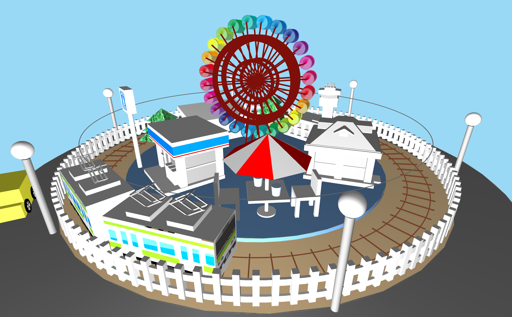
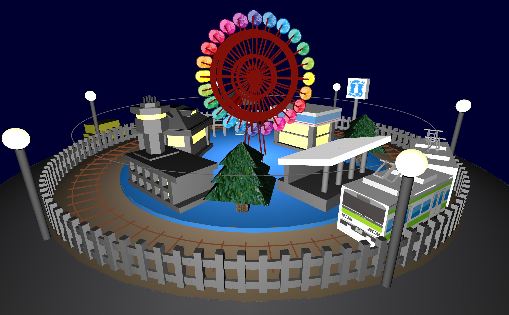

# processing でnintendo zone のような3Dモデルを作ってみた

Nintendo の 3DS デフォルトソフトの１つに,「[nintendo zone](https://www.nintendo.co.jp/nintendozone/)」がある. このパッケージデザインに似た 3D モデルを processing 言語を用いて作成してみた.

円盤状に様々な乗り物や商業施設を配置している. 設計では特定の座標に特定の大きさのオブジェクトを配置するだけではなく, 座標の移動と拡大縮小に柔軟に対応するように作成した.

 この作品はほとんどが直方体と円柱と球のみで構成されている. それだけでも観覧車や電車のパンタグラフなど細かいパーツまで実装できるの点が, ビジュアルデザインに特化した言語の面白さである.
 
 

↑ 夜間モードにも対応している.
 

# 起動方法
[Processing](https://processing.org/) をPCにインストールした状態でこのリポジトリ内の ./superDiorama/superDiorama.pde ファイルをダブルクリック.

テスト時の環境
- processing-3.5.3-windows64

# 遊び方
画面上でカーソルを上下移動させることで縦方向の視点移動. キーボードの N で(昼)↔(夜) の 変更. キーボードの S で画像保存.
